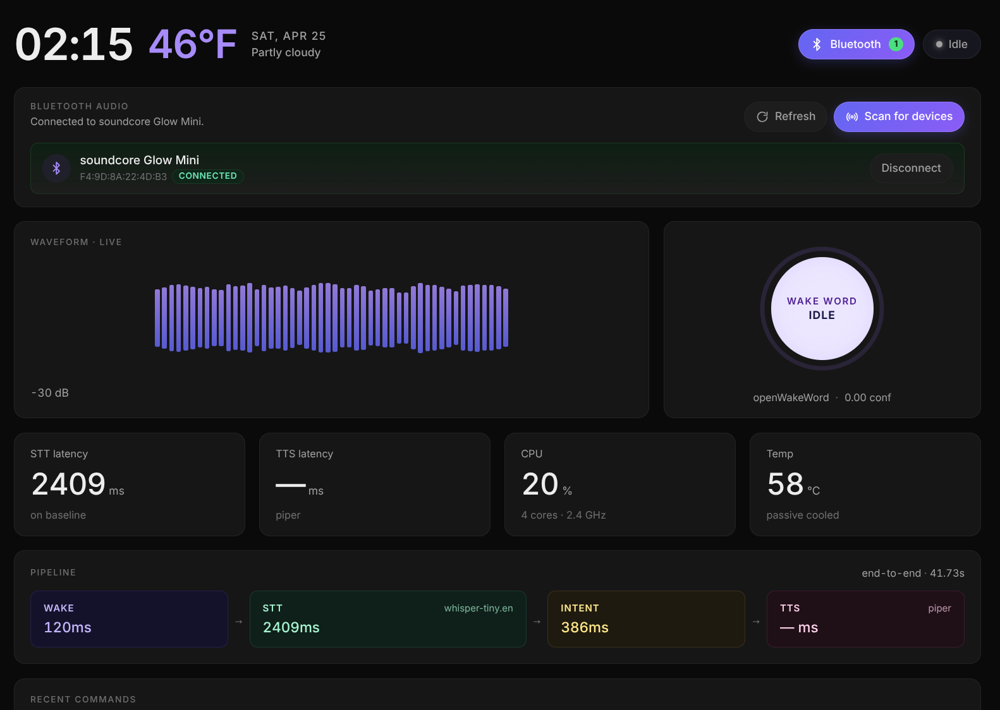

# Pi Assistant

A self-hosted voice assistant for the Raspberry Pi 5 + 7" touchscreen.
Wake word → speech-to-text → LLM → speech, with a live dashboard so you can watch the whole pipeline.



---

## Quick start

```bash
git clone <this-repo> ~/pi-assistant
cd ~/pi-assistant
./install.sh                 # installs deps, models, service, kiosk
nano .env                    # set GOOGLE_API_KEY (Gemini)
sudo reboot
```

That's it. After reboot the kiosk auto-starts and the assistant is listening for "Hey Jarvis".

> Hardware target: **Pi 5 + official 7" touchscreen (800×480)**. Works on any Linux box too — the dashboard just goes wider.

---

## Daily commands

Everything runs as a **user** systemd service (no `sudo`):

```bash
systemctl --user restart pi-assistant       # apply any code/.env change
systemctl --user status  pi-assistant       # is it running?
journalctl  --user -u pi-assistant -f       # live logs
```

`restart` is the one-liner you need most. Backend code, frontend code, and `.env` all reload from a single restart — the kiosk auto-refreshes itself when the new server comes up.

To debug in the foreground:

```bash
systemctl --user stop pi-assistant
source .venv/bin/activate
python run.py
```

---

## Configuration (`.env`)

Edit `~/pi-assistant/.env`, then `systemctl --user restart pi-assistant`.

| Variable | Default | Notes |
| --- | --- | --- |
| `GOOGLE_API_KEY` | _required_ | Gemini API key. |
| `LLM_MODEL` | `gemini-2.5-flash` | Any Gemini chat model id. |
| `WAKE_WORD` | `hey_jarvis` | Any pretrained openWakeWord model. |
| `WAKE_WORD_THRESHOLD` | `0.4` | Lower = more sensitive. |
| `WAKE_WORD_CONSECUTIVE_FRAMES` | `2` | Raise to `3` to suppress false wakes. |
| `STT_MODEL_SIZE` | `tiny.en` | `tiny.en` / `base.en` / `small.en`. |
| `TTS_VOICE` | `amy` | `amy`, `lessac`, `hfc_female`, `libritts_r`, `ryan_high`. |
| `TTS_LENGTH_SCALE` | `0.8` | `<1` faster, `>1` slower. |
| `WEATHER_LAT` / `WEATHER_LON` | NYC | Open-Meteo, no key. |
| `HOST` / `PORT` | `0.0.0.0` / `9091` | FastAPI bind. |

---

## The dashboard

Open `http://<pi-ip>:9091` (or just look at the kiosk screen).

- **Header** — clock, date, weather. Bluetooth toggle + state pill on the right.
- **Waveform · Live** — real-time mic level. Last utterance + duration underneath.
- **Wake word** — confidence ring; flashes purple on detection.
- **Metrics row** — STT / TTS latency, CPU %, SoC temperature.
- **Pipeline strip** — per-stage timing for the last turn: WAKE → STT → INTENT → TTS, plus end-to-end.
- **Recent commands** — scrollable history of what the assistant heard.

While the assistant is non-idle a Siri-style glow runs around the screen edge:

- Listening → cyan / indigo / violet
- Thinking → yellow / amber / orange
- Speaking → pink / violet / cyan
- Wake detected → brief brighter pulse

Retheme by editing `body[data-state="..."]` colors in [frontend/css/styles.css](frontend/css/styles.css).

---

<details>
<summary><b>Audio prerequisites (PipeWire) — once per machine</b></summary>

The backend writes audio through ALSA → PipeWire. A fresh Bookworm Pi has the daemon enabled but **`wireplumber`** (the session manager) and **`pipewire-pulse`** (the PulseAudio shim) are not. Without them, PipeWire has zero real sinks and TTS gets routed to `auto_null` (silence).

```bash
systemctl --user enable --now pipewire pipewire-pulse wireplumber
pactl list short sinks
# good:  74  bluez_output.XX_XX_XX_XX_XX_XX.1   PipeWire   ...
# bad:   0   auto_null                          module-null-sink.c   ...
```

`pi-assistant.service` declares `After=`/`Wants=` on these three units, so the backend always starts after they're ready.

</details>

<details>
<summary><b>Tuning the wake word</b></summary>

If you have to shout "Hey Jarvis" to be heard, the score is clearing the threshold but only barely. Watch live:

```bash
journalctl --user -u pi-assistant -f | grep -i 'wake word detected'
# Wake word detected: 'hey_jarvis' (score: 0.87)
```

If usable scores cluster around 0.5–0.8, the default 0.6 is too strict.

| Symptom | Try |
| --- | --- |
| Have to shout | Lower `WAKE_WORD_THRESHOLD` to `0.4`, then `0.3` |
| TV / chatter triggers it | Raise `WAKE_WORD_THRESHOLD` to `0.5`+ **or** `WAKE_WORD_CONSECUTIVE_FRAMES` to `3` |
| Mic gain low | `amixer -c 0 sset 'Mic' 100%` first |

</details>

<details>
<summary><b>Tuning listen behaviour (cuts you off / TV hijack)</b></summary>

Knobs at the top of `_listen_and_transcribe` in [backend/audio/pipeline.py](backend/audio/pipeline.py):

| Constant | Default | Raising it does |
| --- | --- | --- |
| `max_silence` | `14` (~0.9s) | Tolerates longer mid-sentence pauses |
| `max_duration` | `235` (~15s) | Longer hard cap per utterance |
| `silence_rms = max(0.018, floor × 3.0)` | — | Higher → only louder/closer speech counts. Bump `× 3.0` to `× 4.0` if a TV still hijacks the mic |

The threshold is **adaptive** — a rolling 12.8s window of mic RMS feeds a 25th-percentile noise-floor estimate at each wake. Quiet rooms and TV-on rooms both get sensible thresholds without you tweaking. Watch:

```bash
journalctl --user -u pi-assistant -f | grep '\[vad\]'
# [vad] ambient_floor=0.0061 silence_rms=0.0183     # quiet room
# [vad] ambient_floor=0.0240 silence_rms=0.0720     # TV in background
```

</details>

<details>
<summary><b>Kiosk (Chromium fullscreen)</b></summary>

The kiosk is a plain autostart entry (`~/.config/autostart/kiosk.desktop` → [scripts/kiosk.sh](scripts/kiosk.sh)), not a systemd service.

Frontend changes auto-reload on backend restart (the new `SERVER_ID` triggers a `window.location.reload()`). Static files ship `Cache-Control: no-store`, so no stale JS/CSS.

Manual controls:

```bash
# Soft refresh on the Pi:
#   Ctrl+Shift+R

# Restart Chromium:
pkill -f chromium
~/pi-assistant/scripts/kiosk.sh &

# Stop entirely (e.g. while debugging in a normal browser):
pkill -f chromium
```

</details>

<details>
<summary><b>Upgrade / reinstall</b></summary>

```bash
cd ~/pi-assistant
git pull
source .venv/bin/activate
pip install -r requirements.txt
systemctl --user restart pi-assistant
```

If `scripts/pi-assistant.service` changed:

```bash
cp scripts/pi-assistant.service ~/.config/systemd/user/
systemctl --user daemon-reload
systemctl --user restart pi-assistant
```

Re-running `./install.sh` is idempotent and does the full upgrade path (deps, models, service, kiosk).

</details>

<details>
<summary><b>Autostart at boot</b></summary>

```bash
systemctl --user enable  pi-assistant     # start on boot
systemctl --user disable pi-assistant
```

Boot-without-login needs lingering (set once by `install.sh`):

```bash
sudo loginctl enable-linger "$USER"
```

</details>

<details>
<summary><b>Uninstall</b></summary>

```bash
systemctl --user disable --now pi-assistant
rm ~/.config/systemd/user/pi-assistant.service
systemctl --user daemon-reload
```

</details>
